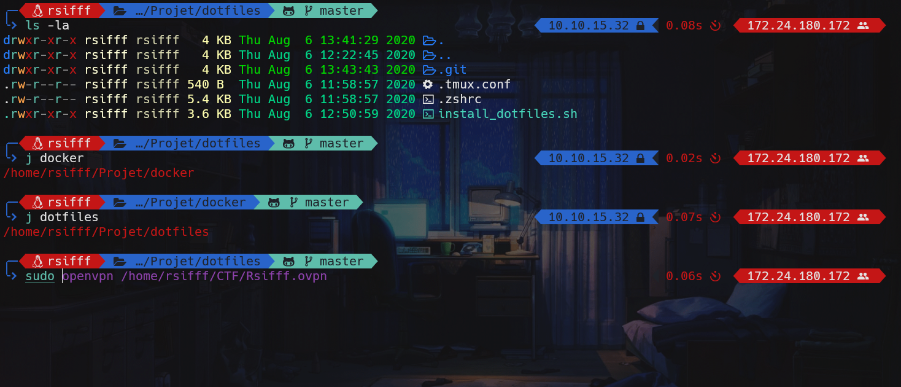

# dotfiles

This project was carried out to practice bash language and to rapidly deploy a work environment.



## Installation

To install the dotfiles, you must use a user with administrator rights

```bash
wget https://raw.githubusercontent.com/Rsifff/dotfiles/master/install_dotfiles.sh
chmod +x install_dotfiles.sh
sudo ./install_dotfiles.sh

