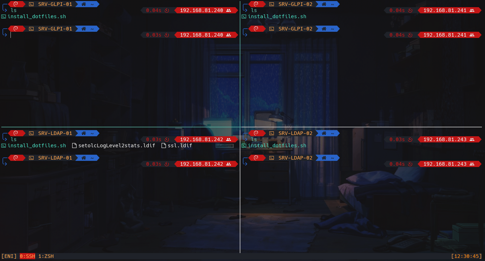

# dotfiles

This script allows you to obtain this result 


This script allows you to deploy a functional configuration, quickly and simply. The plugins will allow you to have a pleasant environment and to gain in productivity. 



## :gear: Plugins ZSH

- [thefuck](https://github.com/nvbn/thefuck)
- [zsh-syntax-highlighting](https://github.com/zsh-users/zsh-syntax-highlighting)
- [zsh-completions](https://github.com/zsh-users/zsh-completions)
- [zsh-autosuggestions](https://github.com/zsh-users/zsh-autosuggestions)
- [tmux](https://github.com/ohmyzsh/ohmyzsh/tree/master/plugins/tmux)
- [autojump](https://github.com/wting/autojump)
- [git](https://github.com/ohmyzsh/ohmyzsh/tree/master/plugins/git)

## :toolbox: Tools 

- [lolcat](https://github.com/busyloop/lolcat)
- [neofetch](https://github.com/dylanaraps/neofetch)
- [tmux](https://github.com/tmux/tmux/wiki)
- [tmuxinator](https://github.com/tmuxinator/tmuxinator)
- [lsd (LSDeluxe)](https://github.com/Peltoche/lsd)


## :open_book: Installation

To install the dotfiles, you must use a user with administrator rights

```bash
wget https://raw.githubusercontent.com/Rsifff/dotfiles/master/install_dotfiles.sh
chmod +x install_dotfiles.sh
./install_dotfiles.sh
rm install_dotfiles.sh
```
